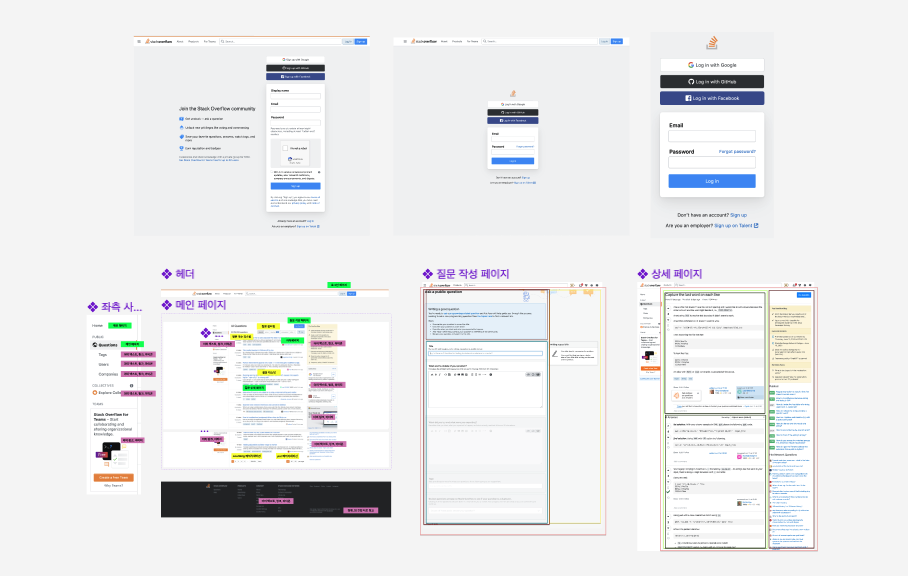
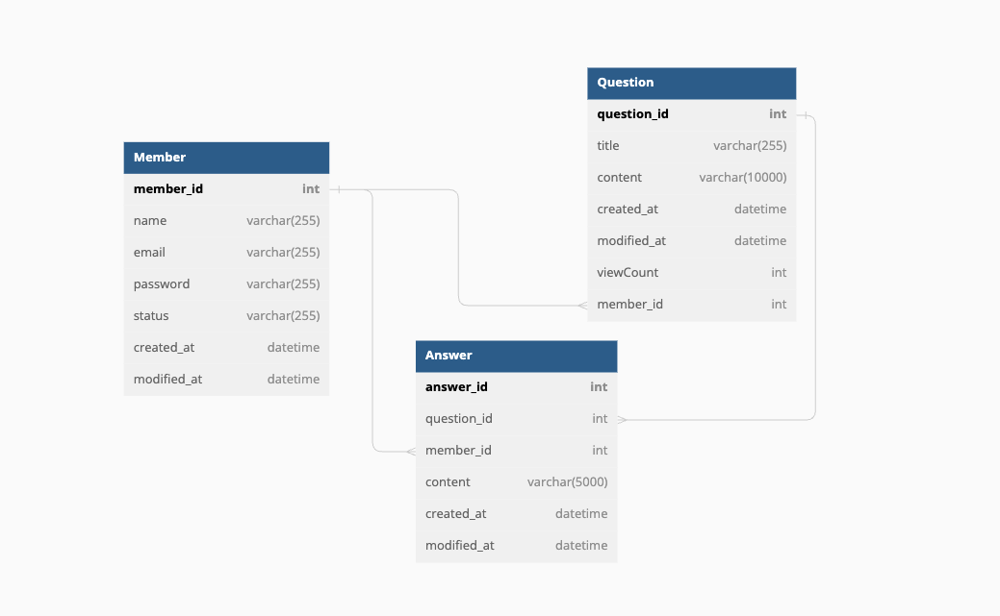
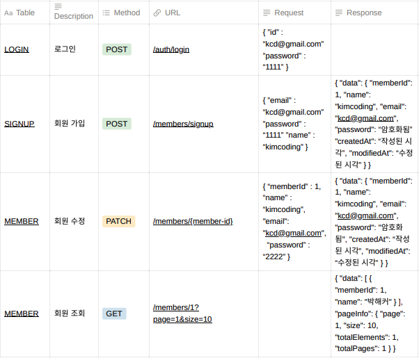
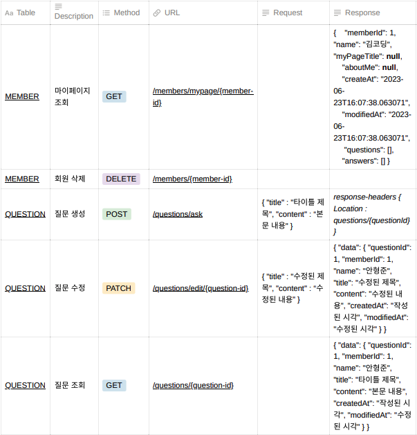
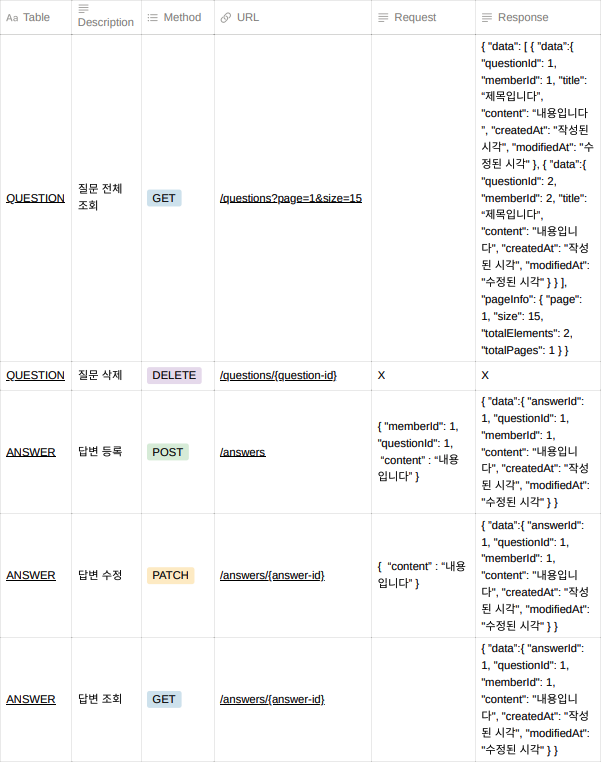

<br/>

<div align="center">


</div>

</br>

- **`팀 명` :** 🌟 누구보다빛나조
- **`프로젝트 명` :** Stackoverflow 클론
- **`프로젝트 기간` :** 2023.06.09 - 2023.06.27
- **`프로젝트 팀원` :** 최연수, 김영웅, 유지예, 조성원, 이보미, 서승아, 안형준
- **`배포 링크` :** [🌐 stackoverflowClone](http://)
- **`요구사항 정의서`:** [사용자 요구사항 정의서](https://www.notion.so/codestates/ec595b076d2745ffaa9668bcc0bd1006)

<br/>

## 💼 Team

|                                                                 최연수<br>(FE, 팀장)                                                                  |                                 김영웅<br>(FE)                                 |                   유지예<br>(FE)                   |                   조성원<br>(FE)                   |               이보미<br>(BE, 부팀장)               |                   서승아<br>(BE)                   |                  안형준<br> (BE)                   |
| :---------------------------------------------------------------------------------------------------------------------------------------------------: | :----------------------------------------------------------------------------: | :------------------------------------------------: | :------------------------------------------------: | :------------------------------------------------: | :------------------------------------------------: | :------------------------------------------------: | -------------------------------------------------- |
|  |                              |  |  |  |  |  |  |
|         <p align="left">**Pages**<br/> - Before Login Main Page<br/> - After Login Main Page<br/><br/>**Features**<br/>- Pagination <br/></p>         | <p align="left">**Pages**<br/>- <br/>- <br/>- <br/>**Components**<br/>- <br/>- |

|  Name  | Github ID                                      |
| :----: | :--------------------------------------------- |
| 최연수 | [@ella-yschoi](https://github.com/ella-yschoi) |
| 김영웅 | [@novice-hero](https://github.com/novice-hero) |
| 유지예 | [@jiye-7](https://github.com/jiye-7)           |
| 조성원 | [@thejsw](https://github.com/thejsw)           |
| 이보미 | [@spring333](https://github.com/spring333)     |
| 서승아 | [@tjtmddk720](https://github.com/tjtmddk720)   |
| 안형준 | [@JERE-GIM](https://github.com/JERE-GIM)       |

<br/>

### <span style=""> ⚙️ **Tools** </span>

|                                                   Github                                                    |                                                                                       Discord                                                                                        |                                                                                   Notion                                                                                    |
| :---------------------------------------------------------------------------------------------------------: | :----------------------------------------------------------------------------------------------------------------------------------------------------------------------------------: | :-------------------------------------------------------------------------------------------------------------------------------------------------------------------------: |
|  |  |  |

<br/>

### <span style=""> 🖥 **Front-end** </span>

|                                                                                     Html                                                                                     |                                                                                                       CSS                                                                                                        |                                                                                                               TypeScript                                                                                                               |                                                                              React                                                                               |                                                                        Styled-<br>Components                                                                        |                                                                 axios                                                                 |                                                                                               Prittier                                                                                               |                                                                                               esLint                                                                                                |                                                                                              React-Quill                                                                                              |
| :--------------------------------------------------------------------------------------------------------------------------------------------------------------------------: | :--------------------------------------------------------------------------------------------------------------------------------------------------------------------------------------------------------------: | :------------------------------------------------------------------------------------------------------------------------------------------------------------------------------------------------------------------------------------: | :--------------------------------------------------------------------------------------------------------------------------------------------------------------: | :-----------------------------------------------------------------------------------------------------------------------------------------------------------------: | :-----------------------------------------------------------------------------------------------------------------------------------: | :--------------------------------------------------------------------------------------------------------------------------------------------------------------------------------------------------: | :-------------------------------------------------------------------------------------------------------------------------------------------------------------------------------------------------: | :---------------------------------------------------------------------------------------------------------------------------------------------------------------------------------------------------: |
|  | <div style="display: flex; align-items: flex-start;"></div> | <div style="display: flex; align-items: flex-start;"></div> | <div style="display: flex; align-items: flex-start;"></div> | <div style="display: flex; align-items: flex-start;"></div> | <div style="display: flex; align-items: flex-start;"></div> | <div style="display: flex; align-items: flex-start;"></div> | <div style="display: flex; align-items: flex-start;"></div> | <div style="display: flex; align-items: flex-start;"></div> |

<br/>

### <span style="">🔒 **Back-end**

### </span>

|                                                                              Java                                                                               |                                                                              AWS                                                                               |                                                                              mySQL                                                                               |                                                                                 JWT                                                                                  |                                                       Spring                                                       |                                                   Spring<br>Boot                                                   |
| :-------------------------------------------------------------------------------------------------------------------------------------------------------------: | :------------------------------------------------------------------------------------------------------------------------------------------------------------: | :--------------------------------------------------------------------------------------------------------------------------------------------------------------: | :------------------------------------------------------------------------------------------------------------------------------------------------------------------: | :----------------------------------------------------------------------------------------------------------------: | :----------------------------------------------------------------------------------------------------------------: |
| <div style="display: flex; align-items: flex-start;"></div> | <div style="display: flex; align-items: flex-start;"></div> | <div style="display: flex; align-items: flex-start;"></div> |  |  |  |

<br/>

<br/>

## 🌟 Pages & Features

|                                |                                |
| :----------------------------: | :----------------------------: |
|        **메인 페이지**         |     **가입/로그인 페이지**     |
|  |  |
|      **질문 작성 페이지**      |         **질문 삭제**          |
|  |  |
|   **질문 답변 편집 페이지**    |        **마이 페이지**         |
|  |  |

<br/>

## 👩🏻‍💻 Wireframe

[Figma 링크](https://www.figma.com/file/MHscNhoxu4dxyygRK8IfQ9/Stackoverflow-Clone?type=design&node-id=0%3A1&mode=design&t=3HAqGRhg7GXv6eYV-1)
<br/>



<br/>

## 🔖 DB Diagram



<br/>

## 💡API 명세서






<br/>

## 📎 Git

### 🌲 Branch

- `main` : 서비스 운영 브랜치
- `develo` : 메인 브랜치 배포전 릴리즈 브랜치
- `feat-fe` : FE 개발 환경 브랜치
- `feat-be` : BE 개발 환경 브랜치
- `feat/개발명` : 기능 개발 브랜치 ex) feat/mainPage

<br/>

```text
📌 PR 메시지 템플릿 📌

## 개요
- 논문 상세페이지 접속 시 논문 정보 api를 불러와서 상세정보를 보여줍니다.
- DOI 클릭 시 논문 원본으로 이동합니다.

## 작업사항
- 논문 상세페이지 레이아웃 구현
- 상세페이지 url 쿼리로 논문 정보 api 호출

### 참고사항
- reference에 title이 없으면 보이지 않도록 설정했습니다.
- api 호출 시 에러 처리는 추후 구현 예정입니다.

### 스크린샷
- gif, 이미지 파일 등

## 리뷰 요청사항
- 참고사항의 예외 처리 이외에 추가로 예외 처리가 필요한 부분이 있을 지 조언 부탁드립니다.

📌 코드리뷰 & 머지 규칙 📌

1. push 하기 전 `git pull origin dev` 으로 충돌을 방지합니다.
2. dev 브랜치로 merge하기 전 PR을 생성니다.
3. Merge 후 브랜치는 삭제합니다.
4. PR 리뷰 하나 이상이 달려야 main 브랜치로 merge될 수 있도록 설정합니다.
5. 리뷰는 각 FE & BE 팀원 모두에게 받습니다. (필요 시 팀원들과 퀵하게 논의)
6. 해당 브랜치별로 담당 인원분들 코드리뷰 및 approve 후 Merge 합니다.

```

<br/>

### ✉️ Commit Message

|  Message   | 설명                                                  |
| :--------: | :---------------------------------------------------- |
|   [feat]   | 새로운 기능을 추가할 경우 ex) [feat] 로그인 기능 추가 |
|   [fix]    | 버그 수정에 대한 커밋                                 |
|   [init]   | 브랜치 시작                                           |
| [refactor] | 효율을 위한 코드 리팩토링에 대한 커밋                 |
|  [style]   | 컨벤션에 맞춘 코드 스타일 또는 포맷 등에 관한 커밋    |
|   [docs]   | 문서 및 주석 수정                                     |

<br/>

### 🔥 Our Team Culture

```text
📌 우리 팀의 문화 📌

🌟 스크럼
- 오전 스크럼 (10:00 ~ 10:20): 전날 완료한 작업 / 오늘 진행할 작업 / 고민 및 공유 상황 등을 논의합니다.
- 오후 스크럼 (15:00 ~ 15:20): 중간 진행 상황 / 고민 및 공유 상황 등을 논의합니다.

🌟 회의와 소통
- 소그룹 Zoom: FE&BE 주 1회
- Discord: FE, BE 각 채널을 통해 소통

🌟 팀 코어 타임
- 오전 스크럼 후 (10:20 ~ 12:00)
- 오후 스크럼 후 (15:20 ~ 18:00)

🌟 기타 규칙
- 휴가나 개인사정 미리 공유
- Task 진행 상황 최대한 자주 공유
- 작업 시 어려움은 <고민 Limit Time> 2시간 까지
- 작업 범위를 최대한 작게 쪼개서 진행
```
